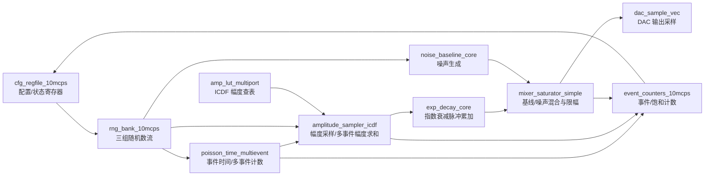

# NuclearWaveGen RTL 模块划分与 IN/OUT 接口说明

本文档基于 `rtl/` 目录下当前 Verilog 源码整理，覆盖工程 filelist 中的综合主路径模块，以及 `rtl/` 内存在但当前未接入顶层的辅助模块。

这里的 IN/OUT 指各模块 Verilog `input`/`output` 端口；每个端口均按方向、位宽和功能逐项说明。

当前 RTL 未发现 `inout` 端口，所有模块接口均为 `input` 或 `output`。

## 1. 工程顶层结构

### 1.1 主数据流

### 1.2 顶层实例关系

`nuc_event_gen_10mcps_io_top` 是面向外部 IO 的轻量封装，内部实例化 `nuc_event_gen_10mcps_top`，并隐藏调试/状态输出。

`nuc_event_gen_10mcps_top` 是功能主顶层，内部实例化：

| 实例 | 模块 | 功能 |
|---|---|---|
| `u_cfg` | `cfg_regfile_10mcps` | 配置寄存器、状态计数读回、种子装载控制 |
| `u_rng` | `rng_bank_10mcps` | 生成 time/amp/noise 三类并行随机数 |
| `u_timebase` | `poisson_time_multievent` | 根据 Q32 事件概率产生每 lane 事件数 |
| `u_amp_lut` | `amp_lut_multiport` | 提供多读口 ICDF 幅度查表 |
| `u_amp_sampler` | `amplitude_sampler_icdf` | 根据事件数和随机数采样幅度并求和 |
| `u_decay` | `exp_decay_core` | 对脉冲幅度做指数衰减累加 |
| `u_noise` | `noise_baseline_core` | 生成可选基线噪声 |
| `u_mixer` | `mixer_saturator_simple` | 将脉冲、基线和噪声混合并限幅到 DAC 位宽 |
| `u_counters` | `event_counters_10mcps` | 可选状态计数器，由 `ENABLE_STATUS_COUNTERS` 控制 |

## 2. 全局约定

| 项目 | 说明 |
|---|---|
| 时钟 | 所有主路径模块使用 `clk` 上升沿同步 |
| 复位 | `rst_n` 为低有效异步复位 |
| 运行使能 | 多数数据通路模块由 `enable` 或 `run_enable` 控制 |
| 并行 lane | `SAMPLES_PER_CLK` 表示每拍并行输出采样数 |
| 多事件 | `MAX_EVENTS_PER_SAMPLE` 表示每个采样周期最多叠加的事件数 |
| 事件计数宽度 | `K_BITS` 承载单 lane 事件数 |
| 幅度查表 | `ICDF_ADDR_BITS` 为 LUT 地址宽度，`AMP_BITS` 为 LUT 输出幅度宽度 |
| DAC 输出 | `DAC_BITS` 为单点 DAC 输出位宽，`dac_sample_vec` 按 lane 拼接 |
| 随机数 | `rng_bank_10mcps` 分别提供 time、amp、noise 三组随机数流 |

## 3. 模块总览

| 模块 | 文件 | 是否主路径使用 | 功能定位 |
|---|---|---|---|
| `nuc_event_gen_10mcps_io_top` | `rtl/nuc_event_gen_10mcps_io_top.v` | 是 | 外部 IO 封装顶层 |
| `nuc_event_gen_10mcps_top` | `rtl/nuc_event_gen_10mcps_top.v` | 是 | 核事件波形发生器主顶层 |
| `cfg_regfile_10mcps` | `rtl/cfg_regfile_10mcps.v` | 是 | 配置/状态寄存器 |
| `rng_bank_10mcps` | `rtl/rng_bank_10mcps.v` | 是 | 多路 RNG bank |
| `rng_xorshift64` | `rtl/rng_xorshift64.v` | 是 | 64-bit xorshift 随机数核心 |
| `poisson_time_multievent` | `rtl/poisson_time_multievent.v` | 是 | Poisson/Bernoulli 多事件时间采样 |
| `const_div_u32_seq` | `rtl/poisson_time_multievent.v` | 内部辅助 | 常数除法流水/时序辅助 |
| `amp_lut_single_port` | `rtl/amp_lut_single_port.v` | 是 | 单读口幅度 LUT |
| `amp_lut_multiport` | `rtl/amp_lut_multiport.v` | 是 | 多读口幅度 LUT 复制封装 |
| `amplitude_sampler_icdf` | `rtl/amplitude_sampler_icdf.v` | 是 | ICDF 幅度采样与多事件求和 |
| `exp_decay_core` | `rtl/exp_decay_core.v` | 是 | 指数衰减状态累加 |
| `noise_baseline_core` | `rtl/noise_baseline_core.v` | 是 | 噪声/基线扰动生成 |
| `mixer_saturator_simple` | `rtl/mixer_saturator_simple.v` | 是 | DAC 混合与饱和限幅 |
| `event_counters_10mcps` | `rtl/event_counters_10mcps.v` | 可选 | 状态计数器 |
| `poisson_time_bernoulli` | `rtl/poisson_time_bernoulli.v` | 当前未接入 | 简化 Bernoulli 事件采样 |

## 4. 顶层模块接口

### 4.1 `nuc_event_gen_10mcps_io_top`

文件：`rtl/nuc_event_gen_10mcps_io_top.v`

功能：工程外部封装顶层，使用较小默认参数实例化主顶层，只暴露配置总线、幅度 LUT 写口和 DAC 输出。

主要参数：

| 参数 | 默认值 | 说明 |
|---|---:|---|
| `SAMPLES_PER_CLK` | 1 | 每拍输出采样数 |
| `DAC_BITS` | 16 | DAC 单采样位宽 |
| `AMP_BITS` | 16 | 幅度 LUT 数据位宽 |
| `IMP_BITS` | 16 | 单 lane 脉冲幅度位宽 |
| `ACC_BITS` | 21 | 衰减累加器位宽 |
| `PULSE_BITS` | 20 | 衰减输出内部位宽 |
| `ICDF_ADDR_BITS` | 14 | 幅度 LUT 地址宽度 |
| `MAX_EVENTS_PER_SAMPLE` | 1 | 每采样最多事件数 |
| `ENABLE_STATUS_COUNTERS` | 0 | 默认关闭状态计数器 |

| 端口 | 方向 | 位宽 | 功能 |
|---|---|---:|---|
| `clk` | input | 1 | 主时钟 |
| `rst_n` | input | 1 | 低有效异步复位 |
| `cfg_valid` | input | 1 | 配置总线访问有效 |
| `cfg_write` | input | 1 | 配置总线写使能，0 表示读 |
| `cfg_addr` | input | 8 | 配置寄存器地址 |
| `cfg_wdata` | input | 32 | 配置写数据 |
| `cfg_rdata` | output | 32 | 配置读数据 |
| `cfg_ready` | output | 1 | 配置访问完成 |
| `amp_lut_we` | input | 1 | 幅度 LUT 写使能 |
| `amp_lut_addr` | input | `ICDF_ADDR_BITS` | 幅度 LUT 写地址 |
| `amp_lut_wdata` | input | `AMP_BITS` | 幅度 LUT 写数据 |
| `dac_sample_vec` | output | `SAMPLES_PER_CLK*DAC_BITS` | DAC 并行输出采样 |
| `dac_sample_valid` | output | 1 | DAC 输出有效 |

### 4.2 `nuc_event_gen_10mcps_top`

文件：`rtl/nuc_event_gen_10mcps_top.v`

功能：核事件波形发生器主顶层，完成配置、随机数生成、事件时间采样、幅度采样、脉冲衰减、噪声基线混合、DAC 限幅输出和可选状态统计。

主要参数：

| 参数 | 默认值 | 说明 |
|---|---:|---|
| `SAMPLES_PER_CLK` | 2 | 每拍并行采样数 |
| `CORE_CLK_HZ` | 250000000 | 核心时钟频率 |
| `MAX_RATE_CPS` | 5000000 | 最大事件率，用于配置限幅 |
| `RNG_BITS` | 64 | 单路随机数位宽 |
| `DAC_BITS` | 16 | DAC 输出位宽 |
| `AMP_BITS` | 16 | 幅度 LUT 输出位宽 |
| `IMP_BITS` | 24 | 脉冲幅度位宽 |
| `ACC_BITS` | 48 | 衰减累加器位宽 |
| `PULSE_BITS` | 32 | 衰减输出内部位宽 |
| `ICDF_ADDR_BITS` | 14 | ICDF LUT 地址宽度 |
| `K_BITS` | 3 | 每 lane 事件计数字段宽度 |
| `MAX_EVENTS_PER_SAMPLE` | 4 | 单 lane 单采样最多事件数 |
| `AMP_READ_PORTS` | `SAMPLES_PER_CLK*MAX_EVENTS_PER_SAMPLE` | 幅度 LUT 并行读口数 |
| `NOISE_BITS` | 16 | 噪声输出位宽 |
| `FRAC_BITS` | 12 | 衰减定点小数位 |
| `ENABLE_STATUS_COUNTERS` | 1 | 是否启用状态计数器 |

| 端口 | 方向 | 位宽 | 功能 |
|---|---|---:|---|
| `clk` | input | 1 | 主时钟 |
| `rst_n` | input | 1 | 低有效异步复位 |
| `cfg_valid` | input | 1 | 配置总线访问有效 |
| `cfg_write` | input | 1 | 配置总线写使能 |
| `cfg_addr` | input | 8 | 配置寄存器地址 |
| `cfg_wdata` | input | 32 | 配置写数据 |
| `cfg_rdata` | output | 32 | 配置读数据 |
| `cfg_ready` | output | 1 | 配置访问完成 |
| `amp_lut_we` | input | 1 | 幅度 LUT 写使能 |
| `amp_lut_addr` | input | `ICDF_ADDR_BITS` | 幅度 LUT 写地址 |
| `amp_lut_wdata` | input | `AMP_BITS` | 幅度 LUT 写数据 |
| `dac_sample_vec` | output | `SAMPLES_PER_CLK*DAC_BITS` | DAC 并行采样输出 |
| `dac_sample_valid` | output | 1 | DAC 输出有效，当前等于运行使能 |
| `event_valid_vec` | output | `SAMPLES_PER_CLK` | 每 lane 是否产生候选事件 |
| `impulse_valid_vec` | output | `SAMPLES_PER_CLK` | 每 lane 是否有有效脉冲注入 |
| `saturation_vec` | output | `SAMPLES_PER_CLK` | 每 lane DAC 输出是否发生限幅 |
| `status_word` | output | 32 | 状态字，来自计数器或置零 |

## 5. 配置与状态模块

### 5.1 `cfg_regfile_10mcps`

文件：`rtl/cfg_regfile_10mcps.v`

功能：提供 32-bit 简单配置总线，生成运行控制、事件率、幅度、衰减、噪声、RNG 种子装载等控制信号，并回读状态计数器。

| 端口 | 方向 | 位宽 | 功能 |
|---|---|---:|---|
| `clk` | input | 1 | 主时钟 |
| `rst_n` | input | 1 | 低有效异步复位 |
| `cfg_valid` | input | 1 | 配置访问有效 |
| `cfg_write` | input | 1 | 配置写使能 |
| `cfg_addr` | input | 8 | 配置地址 |
| `cfg_wdata` | input | 32 | 配置写数据 |
| `cfg_rdata` | output | 32 | 配置读数据 |
| `cfg_ready` | output | 1 | 配置访问应答 |
| `run_enable` | output | 1 | 数据通路运行使能 |
| `soft_reset_pulse` | output | 1 | 软件复位单拍脉冲，用于清衰减/计数等内部状态 |
| `rate_threshold_q32` | output | 32 | Q32 格式事件概率阈值 |
| `amp_lut_en` | output | 1 | 幅度来源选择，1 表示使用 LUT |
| `fixed_amp` | output | `AMP_BITS` | 固定幅度值 |
| `decay_shift` | output | 5 | 衰减右移量 |
| `output_shift` | output | 5 | 脉冲输出缩放右移量 |
| `baseline_offset` | output | signed `DAC_BITS+1` | DAC 混合前基线偏置 |
| `noise_enable` | output | 1 | 噪声使能 |
| `noise_shift` | output | 5 | 噪声缩放右移量 |
| `seed_load` | output | 1 | RNG 种子装载脉冲 |
| `seed_sel` | output | 8 | RNG 种子目标选择 |
| `seed_zero` | output | 1 | 种子为 0 时强制替换为默认非零种子 |
| `seed_data` | output | 64 | RNG 种子数据 |
| `sample_count` | input | 64 | 输出采样计数回读 |
| `candidate_event_count` | input | 64 | 候选事件计数回读 |
| `emitted_event_count` | input | 64 | 已注入事件计数回读 |
| `saturation_count` | input | 64 | 饱和次数计数回读 |
| `status_word_in` | input | 32 | 状态字输入 |

配置寄存器映射：

| 地址 | 名称 | 读写 | 功能 |
|---:|---|---|---|
| `0x00` | `ADDR_CTRL` | R/W | bit0=`run_enable`，写 bit1 产生 `soft_reset_pulse` |
| `0x04` | `ADDR_RATE_Q32` | R/W | 事件概率阈值，写入时按最大事件率阈值限幅 |
| `0x08` | `ADDR_AMP_CTRL` | R/W | bit16=`amp_lut_en`，bits[15:0]=`fixed_amp` |
| `0x0C` | `ADDR_DECAY_SHIFT` | R/W | `decay_shift`，写 0 时修正为 1 |
| `0x10` | `ADDR_OUTPUT_SHIFT` | R/W | `output_shift` |
| `0x14` | `ADDR_BASELINE` | R/W | `baseline_offset` 低位配置 |
| `0x18` | `ADDR_NOISE_CTRL` | R/W | bit0=`noise_enable`，bits[12:8]=`noise_shift` |
| `0x20` | `ADDR_SEED_SEL` | R/W | RNG 种子目标选择 |
| `0x24` | `ADDR_SEED_LO` | R/W | RNG 种子低 32 位 |
| `0x28` | `ADDR_SEED_HI` | R/W | RNG 种子高 32 位 |
| `0x2C` | `ADDR_SEED_COMMIT` | W | 提交种子，产生 `seed_load` 脉冲 |
| `0x40` | `ADDR_SAMPLE_LO` | R | 采样计数低 32 位 |
| `0x44` | `ADDR_SAMPLE_HI` | R | 采样计数高 32 位 |
| `0x48` | `ADDR_CAND_LO` | R | 候选事件计数低 32 位 |
| `0x4C` | `ADDR_CAND_HI` | R | 候选事件计数高 32 位 |
| `0x50` | `ADDR_EMIT_LO` | R | 已注入事件计数低 32 位 |
| `0x54` | `ADDR_EMIT_HI` | R | 已注入事件计数高 32 位 |
| `0x58` | `ADDR_SAT_LO` | R | 饱和计数低 32 位 |
| `0x5C` | `ADDR_SAT_HI` | R | 饱和计数高 32 位 |
| `0x60` | `ADDR_STATUS` | R | 状态字 |

种子选择约定：

| `seed_sel` 范围 | 目标 RNG |
|---|---|
| `0 .. SAMPLES_PER_CLK-1` | time RNG lane |
| `16 .. 16+SAMPLES_PER_CLK-1` | amplitude RNG lane |
| `32 .. 32+SAMPLES_PER_CLK-1` | noise RNG lane |

## 6. 随机数模块

### 6.1 `rng_xorshift64`

文件：`rtl/rng_xorshift64.v`

功能：64-bit xorshift 随机数发生器。支持运行更新、种子装载以及零种子保护。

| 端口 | 方向 | 位宽 | 功能 |
|---|---|---:|---|
| `clk` | input | 1 | 主时钟 |
| `rst_n` | input | 1 | 低有效异步复位 |
| `enable` | input | 1 | 随机状态更新使能 |
| `seed_load` | input | 1 | 种子装载脉冲 |
| `seed_zero` | input | 1 | 指示种子为零，装载默认非零种子 |
| `seed_data` | input | 64 | 外部种子数据 |
| `random_out` | output | 64 | 当前随机数输出 |

### 6.2 `rng_bank_10mcps`

文件：`rtl/rng_bank_10mcps.v`

功能：为每个 lane 生成三组独立随机数流：事件时间、幅度采样和噪声。

| 端口 | 方向 | 位宽 | 功能 |
|---|---|---:|---|
| `clk` | input | 1 | 主时钟 |
| `rst_n` | input | 1 | 低有效异步复位 |
| `enable` | input | 1 | RNG 更新使能 |
| `seed_load` | input | 1 | 种子装载请求 |
| `seed_sel` | input | 8 | 种子目标选择 |
| `seed_zero` | input | 1 | 零种子保护标志 |
| `seed_data` | input | 64 | 种子数据 |
| `rng_time_vec` | output | `SAMPLES_PER_CLK*RNG_BITS` | 事件时间随机数向量 |
| `rng_amp_vec` | output | `SAMPLES_PER_CLK*RNG_BITS` | 幅度采样随机数向量 |
| `rng_noise_vec` | output | `SAMPLES_PER_CLK*RNG_BITS` | 噪声随机数向量 |

## 7. 事件时间模块

### 7.1 `poisson_time_multievent`

文件：`rtl/poisson_time_multievent.v`

功能：根据 `rate_threshold_q32` 和每 lane 随机数，输出单采样内的候选事件数。`MAX_EVENTS_PER_SAMPLE<=1` 时退化为 Bernoulli 采样；大于 1 时计算多阶 Poisson 阈值。

| 端口 | 方向 | 位宽 | 功能 |
|---|---|---:|---|
| `clk` | input | 1 | 主时钟 |
| `rst_n` | input | 1 | 低有效异步复位 |
| `enable` | input | 1 | 事件时间采样使能 |
| `rate_threshold_q32` | input | 32 | Q32 事件概率阈值 |
| `rng_time_vec` | input | `SAMPLES_PER_CLK*RNG_BITS` | 每 lane 随机数输入 |
| `event_valid_vec` | output | `SAMPLES_PER_CLK` | 每 lane 是否产生候选事件 |
| `event_count_vec` | output | `SAMPLES_PER_CLK*K_BITS` | 每 lane 候选事件个数 |

### 7.2 `const_div_u32_seq`

文件：`rtl/poisson_time_multievent.v`

功能：`poisson_time_multievent` 内部常数除法辅助模块，用恢复除法顺序计算 `dividend / DIVISOR`，用于生成高阶 Poisson 阈值。

| 端口 | 方向 | 位宽 | 功能 |
|---|---|---:|---|
| `clk` | input | 1 | 主时钟 |
| `rst_n` | input | 1 | 低有效异步复位 |
| `start` | input | 1 | 开始一次除法 |
| `dividend` | input | 32 | 被除数 |
| `busy` | output | 1 | 除法进行中 |
| `done` | output | 1 | 除法完成单拍标志 |
| `quotient` | output | 32 | 商 |

### 7.3 `poisson_time_bernoulli`

文件：`rtl/poisson_time_bernoulli.v`

功能：简化 Bernoulli 事件采样模块，当前不在 `rtl/filelist.f` 主路径中，也未被当前顶层实例化。每 lane 使用随机数低 32 位与阈值比较得到事件有效位。

| 端口 | 方向 | 位宽 | 功能 |
|---|---|---:|---|
| `enable` | input | 1 | 组合输出使能 |
| `rate_threshold_q32` | input | 32 | Q32 事件概率阈值 |
| `rng_time_vec` | input | `SAMPLES_PER_CLK*RNG_BITS` | 每 lane 随机数输入 |
| `event_valid_vec` | output | `SAMPLES_PER_CLK` | 每 lane 事件有效输出 |

## 8. 幅度 LUT 与采样模块

### 8.1 `amp_lut_single_port`

文件：`rtl/amp_lut_single_port.v`

功能：单写单读同步幅度 LUT，可选择初始化为 ramp 或从文件初始化。

| 端口 | 方向 | 位宽 | 功能 |
|---|---|---:|---|
| `clk` | input | 1 | 主时钟 |
| `wr_en` | input | 1 | LUT 写使能 |
| `wr_addr` | input | `ADDR_BITS` | LUT 写地址 |
| `wr_data` | input | `DATA_BITS` | LUT 写数据 |
| `rd_addr` | input | `ADDR_BITS` | LUT 读地址 |
| `rd_data` | output | `DATA_BITS` | LUT 同步读数据 |

### 8.2 `amp_lut_multiport`

文件：`rtl/amp_lut_multiport.v`

功能：通过复制 `amp_lut_single_port` 形成多读口 LUT。所有副本共享同一个写口，读口彼此独立。

| 端口 | 方向 | 位宽 | 功能 |
|---|---|---:|---|
| `clk` | input | 1 | 主时钟 |
| `wr_en` | input | 1 | 所有 LUT 副本公共写使能 |
| `wr_addr` | input | `ADDR_BITS` | 公共写地址 |
| `wr_data` | input | `DATA_BITS` | 公共写数据 |
| `rd_addr_vec` | input | `PORTS*ADDR_BITS` | 多读口地址向量 |
| `rd_data_vec` | output | `PORTS*DATA_BITS` | 多读口读数据向量 |

### 8.3 `amplitude_sampler_icdf`

文件：`rtl/amplitude_sampler_icdf.v`

功能：根据事件数和随机数生成 ICDF LUT 地址，读取幅度后按 lane 对多事件幅度求和，输出脉冲注入幅度。

| 端口 | 方向 | 位宽 | 功能 |
|---|---|---:|---|
| `clk` | input | 1 | 主时钟 |
| `rst_n` | input | 1 | 低有效异步复位 |
| `enable` | input | 1 | 幅度采样流水使能 |
| `amp_lut_en` | input | 1 | 1 使用 LUT 幅度，0 使用固定幅度 |
| `fixed_amp` | input | `AMP_BITS` | 固定幅度值 |
| `event_valid_vec` | input | `SAMPLES_PER_CLK` | 每 lane 候选事件有效 |
| `event_count_vec` | input | `SAMPLES_PER_CLK*K_BITS` | 每 lane 候选事件数 |
| `rng_amp_vec` | input | `SAMPLES_PER_CLK*RNG_BITS` | 幅度采样随机数 |
| `icdf_rd_addr_vec` | output | `AMP_READ_PORTS*ICDF_ADDR_BITS` | 幅度 LUT 读地址 |
| `icdf_rd_data_vec` | input | `AMP_READ_PORTS*AMP_BITS` | 幅度 LUT 读数据 |
| `impulse_valid_vec` | output | `SAMPLES_PER_CLK` | 每 lane 是否输出脉冲注入 |
| `impulse_count_vec` | output | `SAMPLES_PER_CLK*K_BITS` | 每 lane 实际注入事件数 |
| `impulse_sum_vec` | output | `SAMPLES_PER_CLK*IMP_BITS` | 每 lane 多事件幅度和，饱和到 `IMP_BITS` |

## 9. 脉冲、噪声与输出模块

### 9.1 `exp_decay_core`

文件：`rtl/exp_decay_core.v`

功能：每 lane 维护一个指数衰减状态，按 `decay_shift` 衰减并叠加新脉冲，再经 `output_shift` 缩放输出。

| 端口 | 方向 | 位宽 | 功能 |
|---|---|---:|---|
| `clk` | input | 1 | 主时钟 |
| `rst_n` | input | 1 | 低有效异步复位 |
| `enable` | input | 1 | 衰减状态更新使能 |
| `clear` | input | 1 | 清空内部衰减状态 |
| `decay_shift` | input | 5 | 衰减项右移量 |
| `output_shift` | input | 5 | 输出脉冲缩放右移量 |
| `impulse_valid_vec` | input | `SAMPLES_PER_CLK` | 新脉冲注入有效 |
| `impulse_sum_vec` | input | `SAMPLES_PER_CLK*IMP_BITS` | 新脉冲幅度和 |
| `pulse_vec` | output | `SAMPLES_PER_CLK*PULSE_BITS` | 每 lane 衰减后脉冲输出 |
| `state_overflow` | output | 1 | 衰减状态溢出标志 |

### 9.2 `noise_baseline_core`

文件：`rtl/noise_baseline_core.v`

功能：从每 lane 随机数中提取低 16 位，中心化为有符号噪声，再按 `noise_shift` 缩放输出。

| 端口 | 方向 | 位宽 | 功能 |
|---|---|---:|---|
| `clk` | input | 1 | 主时钟 |
| `rst_n` | input | 1 | 低有效异步复位 |
| `enable` | input | 1 | 噪声更新使能 |
| `noise_enable` | input | 1 | 噪声输出使能 |
| `noise_shift` | input | 5 | 噪声右移缩放量 |
| `rng_noise_vec` | input | `SAMPLES_PER_CLK*RNG_BITS` | 噪声随机数输入 |
| `noise_vec` | output | `SAMPLES_PER_CLK*NOISE_BITS` | 每 lane 有符号噪声输出 |

### 9.3 `mixer_saturator_simple`

文件：`rtl/mixer_saturator_simple.v`

功能：将脉冲、基线偏置和噪声相加，经过一级寄存后限幅到无符号 DAC 输出范围，并产生饱和标志。

| 端口 | 方向 | 位宽 | 功能 |
|---|---|---:|---|
| `clk` | input | 1 | 主时钟 |
| `rst_n` | input | 1 | 低有效异步复位 |
| `enable` | input | 1 | 混合/限幅使能 |
| `baseline_offset` | input | signed `DAC_BITS+1` | 基线偏置 |
| `pulse_vec` | input | `SAMPLES_PER_CLK*PULSE_BITS` | 每 lane 脉冲输入 |
| `noise_vec` | input | `SAMPLES_PER_CLK*NOISE_BITS` | 每 lane 有符号噪声输入 |
| `dac_sample_vec` | output | `SAMPLES_PER_CLK*DAC_BITS` | 每 lane DAC 输出采样 |
| `saturation_vec` | output | `SAMPLES_PER_CLK` | 每 lane 限幅标志 |

## 10. 状态计数模块

### 10.1 `event_counters_10mcps`

文件：`rtl/event_counters_10mcps.v`

功能：统计采样周期、候选事件数、已注入事件数和 DAC 饱和次数，并生成状态字。

| 端口 | 方向 | 位宽 | 功能 |
|---|---|---:|---|
| `clk` | input | 1 | 主时钟 |
| `rst_n` | input | 1 | 低有效异步复位 |
| `enable` | input | 1 | 计数使能 |
| `clear` | input | 1 | 计数清零 |
| `event_valid_vec` | input | `SAMPLES_PER_CLK` | 候选事件有效向量 |
| `event_count_vec` | input | `SAMPLES_PER_CLK*K_BITS` | 每 lane 候选事件数 |
| `impulse_valid_vec` | input | `SAMPLES_PER_CLK` | 实际脉冲注入有效向量 |
| `impulse_count_vec` | input | `SAMPLES_PER_CLK*K_BITS` | 每 lane 实际注入事件数 |
| `saturation_vec` | input | `SAMPLES_PER_CLK` | 每 lane DAC 饱和标志 |
| `state_overflow` | input | 1 | 衰减状态溢出输入 |
| `sample_count` | output | 64 | 采样周期累计数 |
| `candidate_event_count` | output | 64 | 候选事件累计数 |
| `emitted_event_count` | output | 64 | 已注入事件累计数 |
| `saturation_count` | output | 64 | 饱和累计数 |
| `status_word` | output | 32 | 状态字 |

状态字含义：

| bit | 含义 |
|---:|---|
| 0 | 出现过 `state_overflow` |
| 1 | 出现过 DAC 饱和 |
| 2 | 出现过多事件采样，即单 lane 事件数大于 1 |
| 31:3 | 预留，当前为 0 |

## 11. 主要时序与数据有效关系

| 路径 | 说明 |
|---|---|
| 配置路径 | `cfg_valid/cfg_write/cfg_addr/cfg_wdata` 经 `cfg_regfile_10mcps` 产生控制信号，读写均用 `cfg_ready` 应答 |
| RNG 种子路径 | 写 `ADDR_SEED_LO/HI/SEL` 后写 `ADDR_SEED_COMMIT`，由 `seed_load/seed_sel/seed_data/seed_zero` 装载指定 RNG |
| 事件路径 | `rng_time_vec` 与 `rate_threshold_q32` 进入 `poisson_time_multievent`，输出 `event_valid_vec/event_count_vec` |
| 幅度路径 | `event_count_vec` 与 `rng_amp_vec` 产生 `icdf_rd_addr_vec`，LUT 返回 `icdf_rd_data_vec` 后输出 `impulse_sum_vec` |
| 衰减路径 | `impulse_sum_vec` 注入 `exp_decay_core`，衰减状态输出 `pulse_vec` |
| 输出路径 | `pulse_vec + baseline_offset + noise_vec` 进入 `mixer_saturator_simple`，输出 `dac_sample_vec/saturation_vec` |
| 统计路径 | 候选事件、实际事件、饱和和溢出送入 `event_counters_10mcps`，再由配置寄存器回读 |

## 12. 维护备注

1. `rtl/filelist.f` 当前主路径未包含 `poisson_time_bernoulli.v`，该模块应视为备用简化实现。
2. `const_div_u32_seq` 定义在 `poisson_time_multievent.v` 内，不是独立文件模块。
3. `nuc_event_gen_10mcps_io_top` 默认关闭状态计数器并压缩参数，适合较小资源占用的外部封装；完整调试/状态输出应使用 `nuc_event_gen_10mcps_top`。
4. 当前工程没有三态总线或双向 IO，因此无 `inout` 接口。
