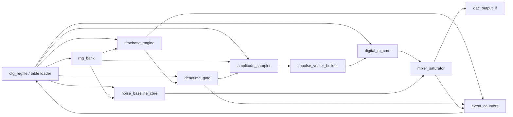

# XC7A100T 核脉冲仿真发生器架构评审与接口草案

整理日期：2026-05-29

评审对象：`nuclear_pulse_generator_architecture.md` 中提出的可扩展核脉冲仿真发生器架构。  
假设测试平台：Xilinx Artix-7 `XC7A100T`。按常见器件资源估算：约 `63k LUT`、`127k FF`、`240 DSP48E1`、`135 RAMB36`。实际可用资源还会受到板级 DAC、时钟、ILA、MicroBlaze/AXI 等外围逻辑影响。

本文中的 `INOUT` 按“输入/输出端口”理解；核心 RTL 内部不建议使用 Verilog `inout` 三态总线。若板级控制总线确实需要双向数据线，应放在 board wrapper 中，核心模块仍使用明确的 `input` / `output`。

## 1. 评审结论

### 1.1 必须调整的资源风险

| 风险点 | 结论 | 建议 |
|---|---|---|
| `SAMPLES_PER_CLK=4` + 16 路 custom shape machine | 若每拍输出 4 个 sample，16 个 shape engine 每拍最多要读 `16 x 4 = 64` 个 shape 点，BRAM 读端口和乘法器压力很大 | XC7A100T 首版不要把 16 路 arbitrary shape 作为 1 GS/s 主路径；首版以 Digital RC/IIR 为主，custom shape 限制为低速模式或 `SHAPE_ENGINES=4` |
| 16-bit ICDF LUT 复制到每个 sample lane | `65536 x 14 bit` 一份约需 `26~28 RAMB36`，4 份接近 `104~112 RAMB36`，会吃掉大部分 BRAM | 首版建议 `ICDF_ADDR_BITS=14` 或 `15`；若要 4 lane 并行查表，优先用 `14-bit ICDF`，4 份约 `28 RAMB36` |
| vector IIR 在 250 MHz 下直接串行展开 | lane0 到 lane3 存在状态递推依赖，直接在一个时钟内串 4 级乘加容易卡时序 | Digital RC 核采用 vector-IIR 闭式展开、DSP48 流水，或首版降到 `SAMPLES_PER_CLK=2` 做时序兜底 |
| 100 Mcps 仍按 Bernoulli 每 sample 单事件 | `fs=1 GS/s` 时 `mu=0.1`，每 sample 出现 `k>=2` 的概率约 `0.47%`，会低估 pile-up 和统计方差 | 端口现在就保留 `event_k_vec` 和 `impulse_sum_vec`；首版 `k=0/1`，后续替换为 Wen 风格 Poisson-k |
| 配置和波形表加载与核心流水混在一起 | host 更新 ICDF/shape/seed 时可能破坏正在运行的随机序列或 RAM 读写 | 配置域和核心域分开；表加载使用 run 停止窗口或 ping-pong RAM；seed 使用显式 `seed_load` 和同步提交 |

### 1.2 推荐 XC7A100T 首版配置

| 参数 | 推荐值 | 原因 |
|---|---:|---|
| `CORE_CLK_HZ` | `250_000_000` | Artix-7 较现实的高速核心时钟 |
| `SAMPLES_PER_CLK` | `4`，时序紧张时降为 `2` | `250 MHz x 4 = 1 GS/s equivalent`，便于 10 Mcps 下模拟 pile-up |
| `TARGET_RATE` | `10 Mcps` | 当前目标 |
| `TIME_MODE` | Bernoulli multi-lane | 资源低、实现简单 |
| `MAX_EVENTS_PER_SAMPLE` | `1`，接口预留到 `4` | 首版够用，未来升 Poisson-k |
| `ICDF_ADDR_BITS` | `14` 首选，`15` 可选 | 控制 BRAM；14-bit 已对齐 16384 能谱 bins |
| `AMP_READ_PORTS` | `SAMPLES_PER_CLK` | 每个 sample lane 独立取幅度，保持 1 ns lane 时序 |
| `PULSE_CORE` | Digital RC/IIR | 高 pile-up 资源最省 |
| `CUSTOM_SHAPE` | 可选低速/调试模式 | 不作为 10 Mcps 主路径 |
| `ACC_BITS` | `48` | 给 pile-up 累加和输出缩放留余量 |
| `DAC_BITS` | `16` | 对齐 DT5810 类输出和常见高速 DAC |

首版资源目标建议控制在：

| 资源 | 建议上限 | 说明 |
|---|---:|---|
| LUT | `< 25k` | 留给控制、ILA、板级接口 |
| FF | `< 35k` | 高速流水会使用较多寄存器 |
| DSP48 | `< 40` | Digital RC、噪声缩放、输出 gain 足够 |
| RAMB36 | `< 50` | 给 ICDF、FIFO、可选 shape RAM 留余量 |

## 2. 资源估算

### 2.1 首版主路径资源估算

| 模块 | LUT | FF | DSP48 | RAMB36 | 备注 |
|---|---:|---:|---:|---:|---|
| `cfg_regfile` + CDC | 1k~2k | 1k~2k | 0 | 0 | 不含 MicroBlaze/AXI interconnect |
| `rng_bank` | 1k~3k | 1k~2k | 0 | 0 | time/amp/noise 多路 xorshift/LFSR |
| `timebase_engine` | 0.5k~1.5k | 0.5k~1k | 0 | 0 | Bernoulli 比较器 |
| `deadtime_gate` | 0.5k~1.5k | 0.5k~1k | 0 | 0 | lane 内按时间顺序扫描 |
| `amplitude_sampler` | 1k~2k | 1k~2k | 0 | `28` | `ICDF_ADDR_BITS=14`，4 lane 复制 |
| `digital_rc_core` | 3k~7k | 4k~8k | `8~24` | 0 | 取决于 vector-IIR 展开方式 |
| `noise_baseline_core` | 1k~3k | 1k~3k | `0~4` | 0~2 | 白噪声可先不用 DSP |
| `mixer_saturator` | 1k~2k | 1k~2k | `4` | 0 | 4 lane gain/clip |
| `event_counters` | 0.5k~1k | 1k~2k | 0 | 0 | 64-bit 计数器可更多 FF |
| 小 FIFO / debug | 1k~2k | 1k~2k | 0 | 1~4 | 事件、状态、ILA 前缓存 |

预计首版合计约 `10k~25k LUT`、`12k~30k FF`、`12~32 DSP48`、`30~40 RAMB36`，在 XC7A100T 上比较稳。

### 2.2 不建议首版同时打开的组合

| 组合 | 资源问题 |
|---|---|
| `ICDF_ADDR_BITS=16` 且 4 lane ICDF 全复制 | 仅 ICDF 就可能用掉 `104~112 RAMB36` |
| `SAMPLES_PER_CLK=4` 且 16 个 full-rate shape engines | 每拍 64 个 shape 读点，BRAM 复制和读端口代价过高 |
| 4 lane 16-bit ICDF + 16 shape engines + 大 ILA | BRAM 几乎被打满，后续很难扩展 |
| Poisson-k 多事件 + 每事件独立 arbitrary shape machine | 100 Mcps 下事件分配与 shape machine 数量会成为瓶颈 |

结论：XC7A100T 适合作为 10 Mcps Digital RC 主路径测试平台；若要验证 DT5810 风格 custom shape，可做成互斥模式或低速模式，而不是与 1 GS/s equivalent 高速主路径同时全开。

## 3. 顶层数据流



核心思想：

- sample vector 是固定速率连续流水，不能靠 `ready` 反压暂停。
- 事件包可以使用 `valid/ready`，但进入 `impulse_vector_builder` 前必须恢复为固定 lane 时序。
- lane 编号即亚采样时间顺序：`lane0` 最早，`lane3` 最晚。
- 所有 `*_vec` 扁平化时约定 lane0 在最低位：`vec[(i+1)*W-1 -: W]` 为第 `i` 个 lane。

## 4. 关键内部数据格式

| 名称 | 推荐宽度 | 说明 |
|---|---:|---|
| `rate_threshold_q32` | 32 | Bernoulli 比较阈值，`threshold = rate / fs * 2^32` |
| `rng_time_vec` | `SAMPLES_PER_CLK * 64` | 每个 sample lane 一路时间随机数 |
| `rng_amp_vec` | `AMP_READ_PORTS * 64` | 幅度查表随机数 |
| `event_valid_vec` | `SAMPLES_PER_CLK` | 每个 sample lane 是否有事件 |
| `event_k_vec` | `SAMPLES_PER_CLK * K_BITS` | 每个 sample lane 的事件数，首版为 0/1 |
| `amp_vec` | `SAMPLES_PER_CLK * AMP_BITS` | 每 lane 抽样幅度 |
| `impulse_sum_vec` | `SAMPLES_PER_CLK * IMP_BITS` | 每 lane 多事件幅度和，送 pile-up 核 |
| `pulse_vec` | `SAMPLES_PER_CLK * PULSE_BITS` | 成形后的内部波形 |
| `noise_vec` | `SAMPLES_PER_CLK * NOISE_BITS` | 噪声和 baseline |
| `dac_sample_vec` | `SAMPLES_PER_CLK * DAC_BITS` | 输出到 DAC wrapper 或仿真捕获 |

推荐参数：

```verilog
parameter integer SAMPLES_PER_CLK       = 4;
parameter integer RNG_BITS              = 64;
parameter integer DAC_BITS              = 16;
parameter integer AMP_BITS              = 16;
parameter integer IMP_BITS              = 24;
parameter integer PULSE_BITS            = 32;
parameter integer ACC_BITS              = 48;
parameter integer ICDF_ADDR_BITS        = 14;
parameter integer K_BITS                = 3;   // 预留 k=0..4
parameter integer MAX_EVENTS_PER_SAMPLE = 1;   // 首版
parameter integer AMP_READ_PORTS        = 4;
```

## 5. 顶层模块端口

建议顶层只暴露板级必要接口，内部表 RAM、随机数、事件流都在 core 内部闭合。

```verilog
module nuc_pulse_emulator_top #(
    parameter integer SAMPLES_PER_CLK       = 4,
    parameter integer RNG_BITS              = 64,
    parameter integer DAC_BITS              = 16,
    parameter integer AMP_BITS              = 16,
    parameter integer IMP_BITS              = 24,
    parameter integer PULSE_BITS            = 32,
    parameter integer ACC_BITS              = 48,
    parameter integer ICDF_ADDR_BITS        = 14,
    parameter integer K_BITS                = 3,
    parameter integer AMP_READ_PORTS        = 4,
    parameter integer CFG_ADDR_BITS         = 16
) (
    input  wire                                clk_core,
    input  wire                                rst_core_n,

    input  wire                                clk_cfg,
    input  wire                                rst_cfg_n,

    input  wire                                ext_trigger,
    input  wire                                ext_gate,
    input  wire                                ext_veto,

    input  wire                                cfg_valid,
    input  wire                                cfg_write,
    input  wire [CFG_ADDR_BITS-1:0]            cfg_addr,
    input  wire [31:0]                         cfg_wdata,
    output wire [31:0]                         cfg_rdata,
    output wire                                cfg_ready,
    output wire                                cfg_error,

    input  wire                                tbl_valid,
    input  wire                                tbl_write,
    input  wire [2:0]                          tbl_id,
    input  wire [15:0]                         tbl_addr,
    input  wire [31:0]                         tbl_wdata,
    output wire                                tbl_ready,
    output wire                                tbl_error,

    output wire [SAMPLES_PER_CLK*DAC_BITS-1:0] dac_sample_vec,
    output wire                                dac_sample_valid,
    output wire [SAMPLES_PER_CLK-1:0]          dac_saturation_vec,

    output wire                                trig_any,
    output wire                                accepted_any,
    output wire                                busy,
    output wire                                irq,
    output wire [31:0]                         status_word
);
```

### 顶层端口说明

| 方向 | 端口 | 说明 |
|---|---|---|
| IN | `clk_core` | 高速核心时钟，目标 250 MHz |
| IN | `rst_core_n` | core 域低有效复位 |
| IN | `clk_cfg` | 配置/表加载时钟，可低于 core |
| IN | `rst_cfg_n` | cfg 域低有效复位 |
| IN | `ext_trigger` | 外部触发输入，用于 external trigger mode |
| IN | `ext_gate` | 外部门控，高有效允许事件 |
| IN | `ext_veto` | 外部 veto，高有效禁止事件 |
| IN | `cfg_*` | 32-bit 简单寄存器总线，可替换为 AXI-Lite |
| IN | `tbl_*` | ICDF、shape、baseline、Poisson CDF 等表加载端口 |
| OUT | `dac_sample_vec` | 连续 sample vector，lane0 在最低位 |
| OUT | `dac_sample_valid` | 输出 sample 有效；运行后通常每拍为 1 |
| OUT | `dac_saturation_vec` | 每个 lane 的饱和标志 |
| OUT | `trig_any` | 本拍存在候选事件 |
| OUT | `accepted_any` | 本拍存在通过 gate/deadtime 的事件 |
| OUT | `busy` | 表加载、shape engine 或 FIFO 接近满 |
| OUT | `irq` | 状态中断，例如 saturation、overflow、run done |
| OUT | `status_word` | 快速状态镜像 |

## 6. 子模块功能和接口

### 6.1 `cfg_regfile`

功能：

- 接收 host 配置、读回状态和计数器。
- 管理 `run_enable`、`soft_reset`、`commit_config`。
- 保存 rate、mode、seed、deadtime、IIR 系数、noise、gain、饱和阈值。
- 在 `clk_cfg` 与 `clk_core` 之间做同步提交。

端口：

```verilog
module cfg_regfile #(
    parameter integer CFG_ADDR_BITS = 16
) (
    input  wire                     clk_cfg,
    input  wire                     rst_cfg_n,
    input  wire                     cfg_valid,
    input  wire                     cfg_write,
    input  wire [CFG_ADDR_BITS-1:0] cfg_addr,
    input  wire [31:0]              cfg_wdata,
    output wire [31:0]              cfg_rdata,
    output wire                     cfg_ready,
    output wire                     cfg_error,

    input  wire                     clk_core,
    input  wire                     rst_core_n,
    output wire                     run_enable_core,
    output wire                     soft_reset_core,
    output wire                     cfg_commit_pulse_core,

    output wire [1:0]               time_mode_core,
    output wire [1:0]               amp_mode_core,
    output wire [1:0]               pulse_mode_core,
    output wire [31:0]              rate_threshold_q32_core,
    output wire [31:0]              deadtime_ticks_core,
    output wire [31:0]              iir_coef_fast_q31_core,
    output wire [31:0]              iir_coef_slow_q31_core,
    output wire [31:0]              noise_sigma_q16_core,
    output wire signed [31:0]       baseline_offset_core,
    output wire signed [31:0]       output_gain_q16_core,
    output wire signed [31:0]       sat_limit_pos_core,
    output wire signed [31:0]       sat_limit_neg_core,

    output wire                     seed_load_core,
    output wire [7:0]               seed_sel_core,
    output wire [63:0]              seed_data_core,

    input  wire [31:0]              status_word_core,
    input  wire [63:0]              candidate_count_core,
    input  wire [63:0]              accepted_count_core,
    input  wire [63:0]              lost_count_core,
    input  wire [63:0]              saturation_count_core
);
```

资源建议：

- 不要在核心内放 MicroBlaze；若需要 MicroBlaze/AXI，放在外层 SoC wrapper。
- 对 `rate`、`coeff`、`seed` 使用 shadow/active 双缓冲，`commit` 时一次切换。

### 6.2 `table_mem_bank`

功能：

- 接收 host 加载的 ICDF、shape、baseline、Poisson CDF 等表。
- 给幅度抽样、shape engine 或未来 Poisson-k 引擎提供只读端口。
- 支持 run 停止窗口更新；未来可扩展 ping-pong 表。

端口：

```verilog
module table_mem_bank #(
    parameter integer ICDF_ADDR_BITS = 14,
    parameter integer AMP_BITS       = 16,
    parameter integer SHAPE_ADDR_BITS= 12,
    parameter integer SHAPE_BITS     = 16,
    parameter integer AMP_READ_PORTS = 4
) (
    input  wire                         clk_cfg,
    input  wire                         rst_cfg_n,
    input  wire                         tbl_valid,
    input  wire                         tbl_write,
    input  wire [2:0]                   tbl_id,
    input  wire [15:0]                  tbl_addr,
    input  wire [31:0]                  tbl_wdata,
    output wire                         tbl_ready,
    output wire                         tbl_error,

    input  wire                         clk_core,
    input  wire                         rst_core_n,
    input  wire [AMP_READ_PORTS*ICDF_ADDR_BITS-1:0] icdf_rd_addr_vec,
    output wire [AMP_READ_PORTS*AMP_BITS-1:0]       icdf_rd_data_vec,

    input  wire [SHAPE_ADDR_BITS-1:0]   shape_rd_addr_a,
    output wire signed [SHAPE_BITS-1:0] shape_rd_data_a,
    input  wire [SHAPE_ADDR_BITS-1:0]   shape_rd_addr_b,
    output wire signed [SHAPE_BITS-1:0] shape_rd_data_b
);
```

资源建议：

- 首版 `ICDF_ADDR_BITS=14`，若 4 lane 并行读，直接复制 4 份 ICDF RAM，换取简单时序。
- `shape_rd_*` 只定义两个端口代表基础 RAM 端口；若需要多 engine full-rate，需要在 `shape_machine_bank` 内部做 RAM 复制，不要污染顶层接口。

### 6.3 `rng_bank`

功能：

- 提供彼此独立的 time、amplitude、noise、aux 随机流。
- 支持固定 seed 复现实验。
- 首版可用 xorshift64/parallel LFSR；后续可替换为 combined Tausworthe 或 LUT-SR RNG。

端口：

```verilog
module rng_bank #(
    parameter integer SAMPLES_PER_CLK = 4,
    parameter integer AMP_READ_PORTS  = 4,
    parameter integer NOISE_STREAMS   = 4,
    parameter integer RNG_BITS        = 64
) (
    input  wire                                      clk_core,
    input  wire                                      rst_core_n,
    input  wire                                      enable,
    input  wire                                      seed_load,
    input  wire [7:0]                                seed_sel,
    input  wire [RNG_BITS-1:0]                       seed_data,

    output wire [SAMPLES_PER_CLK*RNG_BITS-1:0]       rng_time_vec,
    output wire [AMP_READ_PORTS*RNG_BITS-1:0]        rng_amp_vec,
    output wire [NOISE_STREAMS*RNG_BITS-1:0]         rng_noise_vec,
    output wire [RNG_BITS-1:0]                       rng_aux
);
```

资源建议：

- time RNG 与 amplitude RNG 不能共用同一路随机数。
- lane 之间要使用不同 seed、多项式或 stream jump，避免 lane 相关性。

### 6.4 `timebase_engine`

功能：

- 根据 rate 产生候选事件。
- 首版 Bernoulli：每个 lane 比较 `rng_time[31:0] < rate_threshold_q32`。
- 未来 Poisson-k：每个 lane 输出 `k=0..KMAX`。

端口：

```verilog
module timebase_engine #(
    parameter integer SAMPLES_PER_CLK = 4,
    parameter integer RNG_BITS        = 64,
    parameter integer K_BITS          = 3
) (
    input  wire                                clk_core,
    input  wire                                rst_core_n,
    input  wire                                enable,
    input  wire [1:0]                          time_mode,
    input  wire [31:0]                         rate_threshold_q32,
    input  wire [SAMPLES_PER_CLK*RNG_BITS-1:0] rng_time_vec,
    input  wire                                ext_trigger_sync,

    output wire [SAMPLES_PER_CLK-1:0]          cand_valid_vec,
    output wire [SAMPLES_PER_CLK*K_BITS-1:0]   cand_k_vec,
    output wire                                cand_any
);
```

实现建议：

- Bernoulli 模式下 `cand_k_vec` 对应 lane 为 `1` 或 `0`。
- external trigger 模式可以只在 lane0 注入事件，也可以由配置指定插入 lane。
- 未来 Poisson-k 替换时，下游接口无需改动。

### 6.5 `deadtime_gate`

功能：

- 对候选事件执行 gate、veto、deadtime。
- 支持 non-paralyzable / paralyzable deadtime。
- 在一个 `clk_core` 内按 lane0 到 laneN 的时间顺序更新 deadtime 状态。

端口：

```verilog
module deadtime_gate #(
    parameter integer SAMPLES_PER_CLK = 4,
    parameter integer K_BITS          = 3
) (
    input  wire                              clk_core,
    input  wire                              rst_core_n,
    input  wire                              enable,
    input  wire [31:0]                       deadtime_ticks,
    input  wire [1:0]                        deadtime_mode,
    input  wire                              ext_gate_sync,
    input  wire                              ext_veto_sync,

    input  wire [SAMPLES_PER_CLK-1:0]        cand_valid_vec,
    input  wire [SAMPLES_PER_CLK*K_BITS-1:0] cand_k_vec,

    output wire [SAMPLES_PER_CLK-1:0]        acc_valid_vec,
    output wire [SAMPLES_PER_CLK*K_BITS-1:0] acc_k_vec,
    output wire [SAMPLES_PER_CLK-1:0]        lost_valid_vec,
    output wire                              accepted_any,
    output wire                              lost_any
);
```

实现建议：

- deadtime 单位建议使用 sample tick，而不是 core clock tick。`SAMPLES_PER_CLK=4` 时 1 个 core clock 内有 4 个 tick。
- 多事件模式下，若 `k>1`，可按“一个 sample 内多事件同时发生”处理，只触发一次 deadtime，也可配置为按 `k` 次事件处理；建议首版记录 `k` 但 deadtime 只看 sample occupied。

### 6.6 `amplitude_sampler`

功能：

- 根据输入能谱生成幅度随机数。
- 支持 fixed amplitude、ICDF LUT、sequence 三种模式。
- 输出每个 sample lane 的幅度和。

端口：

```verilog
module amplitude_sampler #(
    parameter integer SAMPLES_PER_CLK = 4,
    parameter integer AMP_READ_PORTS  = 4,
    parameter integer RNG_BITS        = 64,
    parameter integer ICDF_ADDR_BITS  = 14,
    parameter integer AMP_BITS        = 16,
    parameter integer IMP_BITS        = 24,
    parameter integer K_BITS          = 3
) (
    input  wire                                clk_core,
    input  wire                                rst_core_n,
    input  wire                                enable,
    input  wire [1:0]                          amp_mode,
    input  wire [AMP_BITS-1:0]                 fixed_amp,

    input  wire [SAMPLES_PER_CLK-1:0]          acc_valid_vec,
    input  wire [SAMPLES_PER_CLK*K_BITS-1:0]   acc_k_vec,
    input  wire [AMP_READ_PORTS*RNG_BITS-1:0]  rng_amp_vec,

    output wire [AMP_READ_PORTS*ICDF_ADDR_BITS-1:0] icdf_rd_addr_vec,
    input  wire [AMP_READ_PORTS*AMP_BITS-1:0]       icdf_rd_data_vec,

    output wire [SAMPLES_PER_CLK-1:0]          impulse_valid_vec,
    output wire [SAMPLES_PER_CLK*IMP_BITS-1:0] impulse_sum_vec,
    output wire                                amp_overflow
);
```

实现建议：

- 首版 `AMP_READ_PORTS=SAMPLES_PER_CLK`，每个 lane 一次 ICDF 查表，固定 1 拍延迟。
- `ICDF_ADDR_BITS=14` 时使用 `rng_amp[13:0]` 或打散后的高位作为地址。
- 未来 `MAX_EVENTS_PER_SAMPLE>1` 时，应把同一 lane 内多个独立幅度求和后送出；若幅度端口不足，增加小型 amplitude scheduler，但必须保证输出 lane 时序固定延迟。

### 6.7 `impulse_vector_builder`

功能：

- 将 accepted event + amplitude 转成送入成形核的 impulse vector。
- 处理脉冲极性、幅度缩放、event mask。

端口：

```verilog
module impulse_vector_builder #(
    parameter integer SAMPLES_PER_CLK = 4,
    parameter integer IMP_BITS        = 24
) (
    input  wire                                clk_core,
    input  wire                                rst_core_n,
    input  wire                                enable,
    input  wire                                pulse_polarity,
    input  wire [SAMPLES_PER_CLK-1:0]          impulse_valid_vec,
    input  wire [SAMPLES_PER_CLK*IMP_BITS-1:0] impulse_sum_vec,

    output wire [SAMPLES_PER_CLK*IMP_BITS-1:0] shaped_impulse_vec,
    output wire                                impulse_any
);
```

实现建议：

- 这个模块很薄，但保留它有利于未来加入 charge collection、ballistic deficit、pile-up 标记等前端效应。

### 6.8 `digital_rc_core`

功能：

- 主 pile-up 成形核。
- 将 impulse vector 转换为指数/双指数/CR-RC 类连续波形。
- pile-up 由 IIR 状态自然累加，不需要为每个事件分配 shape machine。

端口：

```verilog
module digital_rc_core #(
    parameter integer SAMPLES_PER_CLK = 4,
    parameter integer IMP_BITS        = 24,
    parameter integer PULSE_BITS      = 32,
    parameter integer ACC_BITS        = 48
) (
    input  wire                                      clk_core,
    input  wire                                      rst_core_n,
    input  wire                                      enable,
    input  wire [31:0]                               coef_fast_q31,
    input  wire [31:0]                               coef_slow_q31,
    input  wire signed [SAMPLES_PER_CLK*IMP_BITS-1:0] shaped_impulse_vec,

    output wire signed [SAMPLES_PER_CLK*PULSE_BITS-1:0] pulse_vec,
    output wire                                      rc_state_overflow
);
```

实现建议：

- 两个 IIR 状态示意：`fast[n] = a_fast * fast[n-1] + impulse[n]`，`slow[n] = a_slow * slow[n-1] + impulse[n]`，输出 `slow-fast`。
- `SAMPLES_PER_CLK=4` 时不要简单写成一个组合 `for` 串 4 级乘加；建议用预计算 `a^1..a^4` 的 vector-IIR 结构并在 DSP48 间插入寄存器。
- 若 250 MHz 时序压力大，优先把 `SAMPLES_PER_CLK` 参数降为 2，而不是牺牲随机链路正确性。

### 6.9 `shape_machine_bank`，可选模式

功能：

- 支持任意 4096 点脉冲波形。
- 输入 event packet，分配空闲 shape engine。
- 每个 active engine 逐点读取 shape RAM，乘以 amplitude 后累加。

端口：

```verilog
module shape_machine_bank #(
    parameter integer SAMPLES_PER_CLK  = 4,
    parameter integer SHAPE_ENGINES    = 4,
    parameter integer SHAPE_ADDR_BITS  = 12,
    parameter integer AMP_BITS         = 16,
    parameter integer PULSE_BITS       = 32
) (
    input  wire                                      clk_core,
    input  wire                                      rst_core_n,
    input  wire                                      enable,
    input  wire                                      evt_valid,
    output wire                                      evt_ready,
    input  wire [$clog2(SAMPLES_PER_CLK)-1:0]        evt_lane,
    input  wire [AMP_BITS-1:0]                       evt_amp,
    input  wire [3:0]                                evt_shape_id,

    output wire signed [SAMPLES_PER_CLK*PULSE_BITS-1:0] shape_pulse_vec,
    output wire                                      no_free_engine,
    output wire [SHAPE_ENGINES-1:0]                  engine_busy_vec
);
```

资源建议：

- XC7A100T 首版建议 `SHAPE_ENGINES=4`，并作为 `pulse_mode=custom_shape` 的互斥模式。
- 如果要 full-rate `SAMPLES_PER_CLK=4`，每个 engine 每拍要读 4 个连续 shape 点并做 4 次幅度乘法。`SHAPE_ENGINES=16` 会产生 64 读点/拍，不适合作为首版。
- 若后续确实需要高率任意波形 pile-up，优先考虑 FIR/卷积流式成形，而不是无限增加 shape machine。

### 6.10 `noise_baseline_core`

功能：

- 生成白噪声、baseline offset。
- 未来扩展 1/f、random walk、周期干扰。

端口：

```verilog
module noise_baseline_core #(
    parameter integer SAMPLES_PER_CLK = 4,
    parameter integer RNG_BITS        = 64,
    parameter integer NOISE_STREAMS   = 4,
    parameter integer NOISE_BITS      = 32
) (
    input  wire                                      clk_core,
    input  wire                                      rst_core_n,
    input  wire                                      enable,
    input  wire [1:0]                                noise_mode,
    input  wire [31:0]                               noise_sigma_q16,
    input  wire signed [31:0]                        baseline_offset,
    input  wire [NOISE_STREAMS*RNG_BITS-1:0]         rng_noise_vec,

    output wire signed [SAMPLES_PER_CLK*NOISE_BITS-1:0] noise_baseline_vec
);
```

实现建议：

- 首版白噪声可采用 `RND1 - RND2 + RND3 - RND4`，再缩放。
- 1/f 和 random walk 需要额外滤波/积分状态，建议留参数但不放入首版关键路径。

### 6.11 `mixer_saturator`

功能：

- 合并 pulse、noise、baseline。
- 做输出 gain、offset、饱和裁剪和格式转换。

端口：

```verilog
module mixer_saturator #(
    parameter integer SAMPLES_PER_CLK = 4,
    parameter integer PULSE_BITS      = 32,
    parameter integer NOISE_BITS      = 32,
    parameter integer DAC_BITS        = 16
) (
    input  wire                                         clk_core,
    input  wire                                         rst_core_n,
    input  wire                                         enable,
    input  wire signed [31:0]                           output_gain_q16,
    input  wire signed [31:0]                           output_offset,
    input  wire signed [31:0]                           sat_limit_pos,
    input  wire signed [31:0]                           sat_limit_neg,
    input  wire signed [SAMPLES_PER_CLK*PULSE_BITS-1:0] pulse_vec,
    input  wire signed [SAMPLES_PER_CLK*NOISE_BITS-1:0] noise_baseline_vec,

    output wire signed [SAMPLES_PER_CLK*DAC_BITS-1:0]   dac_sample_vec,
    output wire [SAMPLES_PER_CLK-1:0]                   saturation_vec
);
```

实现建议：

- 4 lane gain 缩放通常用 4 个 DSP48。
- 饱和统计要按 lane 计数，不只按 core clock 计数。

### 6.12 `event_counters`

功能：

- 统计候选事件、接收事件、deadtime lost、gate/veto lost、multi-event、饱和、FIFO overflow、shape engine overflow。

端口：

```verilog
module event_counters #(
    parameter integer SAMPLES_PER_CLK = 4
) (
    input  wire                         clk_core,
    input  wire                         rst_core_n,
    input  wire                         enable,
    input  wire [SAMPLES_PER_CLK-1:0]   cand_valid_vec,
    input  wire [SAMPLES_PER_CLK-1:0]   acc_valid_vec,
    input  wire [SAMPLES_PER_CLK-1:0]   lost_valid_vec,
    input  wire [SAMPLES_PER_CLK-1:0]   saturation_vec,
    input  wire                         amp_overflow,
    input  wire                         rc_state_overflow,
    input  wire                         shape_no_free_engine,

    output wire [63:0]                  candidate_count,
    output wire [63:0]                  accepted_count,
    output wire [63:0]                  lost_count,
    output wire [63:0]                  saturation_count,
    output wire [31:0]                  status_word
);
```

实现建议：

- 计数器可以 64-bit，但 host 读回时拆成高低 32-bit。
- 对 `SAMPLES_PER_CLK` 个 lane 做 popcount 后累加，避免每 lane 一个大计数器。

### 6.13 `dac_output_if`

功能：

- 将内部 sample vector 适配到具体 DAC 或测试输出。
- 在无高速 DAC 的 XC7A100T 测试平台上，可先输出到 AXI-Stream FIFO、ILA 或低速并口 DAC。

端口：

```verilog
module dac_output_if #(
    parameter integer SAMPLES_PER_CLK = 4,
    parameter integer DAC_BITS        = 16
) (
    input  wire                                      clk_core,
    input  wire                                      rst_core_n,
    input  wire                                      enable,
    input  wire signed [SAMPLES_PER_CLK*DAC_BITS-1:0] dac_sample_vec,
    input  wire                                      dac_sample_valid,

    output wire [DAC_BITS-1:0]                       dac_data,
    output wire                                      dac_data_valid,
    output wire                                      dac_clk_en,

    output wire [SAMPLES_PER_CLK*DAC_BITS-1:0]        debug_sample_vec,
    output wire                                      debug_sample_valid
);
```

实现建议：

- 真实 1 GS/s DAC 接口通常需要 OSERDES、DDR 或 FMC 高速接口，应放在板级 wrapper 中。
- 核心模块只承诺产生连续 `dac_sample_vec`，不绑定具体 DAC 芯片。

## 7. 10 Mcps 到 100 Mcps 的扩展路径

### 7.1 保持不变的接口

以下接口首版就按未来宽度设计：

- `event_k_vec`：首版只输出 0/1，未来输出 Poisson-k。
- `impulse_sum_vec`：首版为单事件幅度，未来为同 sample 多事件幅度和。
- `K_BITS=3`：预留到 `k=0..4` 或 `0..7`。
- `AMP_READ_PORTS`：参数化，未来可增加到 8 或 16。
- `PULSE_CORE`：Digital RC 主路径不需要知道事件个数，只接收 impulse sum。

### 7.2 需要替换或增强的模块

| 当前模块 | 100 Mcps 扩展 |
|---|---|
| `timebase_engine` | Bernoulli 替换为 Poisson-k CDF/Knuth pipeline/分段近似 |
| `amplitude_sampler` | 每 sample 支持多次 ICDF 抽样并求和，或引入多端口 amplitude scheduler |
| `digital_rc_core` | 保持主路径，增加更宽 accumulator 和更严格饱和统计 |
| `shape_machine_bank` | 不建议扩展为主路径；高率 arbitrary shape 改用 FIR/卷积 |
| `event_counters` | 增加 `multi_event_count`、`k_histogram`、`amp_fifo_overflow` |

## 8. 建议 RTL 实现顺序

1. 固定 `SAMPLES_PER_CLK=4`，先打通 Bernoulli timebase、4 lane ICDF、impulse vector、mixer 输出，不加 IIR。
2. 加入 Digital RC，两级 IIR 先用行为仿真验证，再做 vector-IIR 时序优化。
3. 加入 deadtime/gate/veto，并用 Python/仿真对照事件率和 lost count。
4. 加入白噪声和 saturation/counters。
5. 在 XC7A100T 上做综合，确认 BRAM/DSP/Fmax。
6. 再加入 custom shape 的低速互斥模式。
7. 最后替换 `timebase_engine` 为 Poisson-k，验证 100 Mcps 统计。

## 9. 总体建议

对 XC7A100T 测试平台，最稳的首版是：

```text
4-lane Bernoulli event generator
  + 4-lane 14-bit ICDF amplitude lookup
  + Digital RC vector pile-up core
  + white noise / baseline
  + mixer / saturator / counters
```

这个版本能覆盖 10 Mcps 的核心目标，资源余量足够，并且接口已经为 100 Mcps 的 Poisson-k、多事件幅度求和和更复杂噪声模型预留空间。不要在首版把 DT5810 的所有功能同时堆进 XC7A100T；尤其是 16 路 full-rate arbitrary shape 和 16-bit ICDF 多副本，会让 BRAM 和时序都变得很紧。
